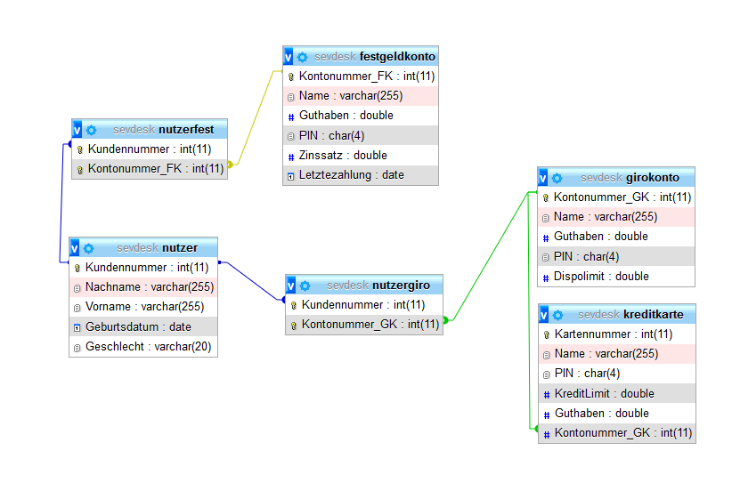

# Probeaufgabe

# MySQL Datenbank
In der sevdesk.sql Datei befindet sich ein SQL befehl um die Datenbank mit den Tabellen zu erstellen.

### Datenbankmodellierung

# Framework

Ich habe mich für das Framework Slim Version 3.12 entschieden
